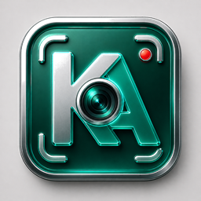

<div align="center">



# Kashot

**The lightweight screenshot tool every platform deserves.**

Drag a region. Annotate. Save, copy, or pin. That's it.

[**kashot.org**](https://kashot.org)
&nbsp;·&nbsp; [Download](https://kashot.org/#download)
&nbsp;·&nbsp; [Roadmap](PLAN.md)
&nbsp;·&nbsp; [Architecture](CLAUDE.md)

[](LICENSE)


[](https://github.com/singhpratech/kashot/actions)

</div>

---

## Why Kashot

Every screenshot tool does too much. Kashot does one thing well, on every platform.

- **Lightweight.** ~10 MB native binary on Linux and macOS. ~30 MB self-contained MSI on Windows. No Electron. No Wine. No bundled browser.
- **Tray-resident.** No main window. Hit the hotkey, drag, annotate, done. Get back to work.
- **Native everywhere.** Same binary discipline on all three OSes — Rust core for Linux/macOS, the existing C# build for Windows. Same hotkeys. Same tools. Same JSON settings.
- **Linux finally has one.** Most Linux capture tools are either heavyweight (Shutter, ksnip) or skip annotation. Kashot ships the same fast, focused workflow Windows users expect.
- **No accounts. No telemetry. No upsell.** Free, open source, MIT.

## Install

<table>
<tr>
<th width="33%">Windows</th>
<th width="33%">Linux</th>
<th width="33%">macOS</th>
</tr>
<tr>
<td valign="top">

[**Download .msi**](https://github.com/singhpratech/kashot/releases/latest/download/Kashot.msi)

Or grab `Kashot.exe` (standalone) or `Kashot-portable.zip` from [releases](https://github.com/singhpratech/kashot/releases/latest).

```powershell
# coming soon
winget install singhpratech.Kashot
choco  install kashot
scoop  install kashot
```

</td>
<td valign="top">

```bash
curl -L https://github.com/singhpratech/kashot/releases/latest/download/kashot-linux-x86_64.tar.gz \
  | tar -xz
./kashot/kashot
```

```bash
# coming soon
flatpak install flathub org.kashot.Kashot
yay -S kashot         # AUR
```

</td>
<td valign="top">

[**Apple Silicon**](https://github.com/singhpratech/kashot/releases/latest/download/Kashot-macos-arm64) &nbsp;·&nbsp;
[Intel](https://github.com/singhpratech/kashot/releases/latest/download/Kashot-macos-x64)

```bash
chmod +x Kashot-macos-arm64
./Kashot-macos-arm64
```

```bash
# coming soon
brew install --cask kashot
```

</td>
</tr>
</table>

> **Status today:** Windows ships the full overlay editor (region select, 9 annotation tools, undo/redo, save/copy/pin). Linux and macOS ship the tray + hotkey + capture-to-PNG core today; the editor port is the next milestone — see [PLAN.md § R7](PLAN.md).

## What it does

Hit `PrintScreen` (or your bound hotkey). Drag a region. Then:

- **9 annotation tools** — pen, line, arrow, rectangle, ellipse, marker, text, numbered steps, pixelate / blur.
- **4 color palettes** — Vivid, Highlighter, Pastel, Pro. 16 swatches each, plus a custom picker.
- **Pixel-accurate selection** — live magnifier with 4× zoom. Drag any edge to resize. `Alt`+drag to move the whole selection.
- **Save · Copy · Pin** — PNG/JPG/BMP, clipboard, or pin a borderless top-most window anywhere on your desktop.
- **Multi-monitor** — capture spans the entire virtual desktop, no per-screen mode-switching.
- **Persistent preferences** — last tool, color, thickness, and save folder remembered between sessions.

## Keyboard shortcuts

Once a region is selected:

| Tools | | Actions | |
|---|---|---|---|
| `P` Pen          | `M` Marker         | `Ctrl`+`Z` Undo            | `Ctrl`+`C` Copy        |
| `L` Line         | `T` Text           | `Ctrl`+`Y` Redo            | `Ctrl`+`S` Save        |
| `A` Arrow        | `N` Numbered step  | `Esc` Cancel / close       | `Alt`+drag Move        |
| `R` Rectangle    | `B` Blur / pixelate| Drag edges Resize          |                        |
| `E` Ellipse      |                    |                            |                        |

## Build from source

This repo contains two implementations side-by-side:

```text
Kashot/        — C# / .NET 8 / WinForms (Windows-only, current shipping build)
kashot-rs/     — Rust workspace (cross-platform; tray + capture core today)
```

```sh
# Windows build (C#) — requires .NET 8 SDK + WiX 5
./Installer/build.ps1
# → Kashot.msi, Kashot.exe, Kashot-portable.zip at repo root

# Cross-platform build (Rust)
cd kashot-rs
cargo test  -p kashot-core             # pure logic, no system deps
cargo build --release --bin kashot     # native binary
```

Linux build deps and full architecture notes are in [`CLAUDE.md`](CLAUDE.md).

## Project layout

```
Kashot/                — C# / WinForms reference build (Windows)
kashot-rs/             — Rust workspace (cross-platform port)
  crates/kashot-core      — Tool, Annotation, Settings, Theme — pure logic
  crates/kashot-platform  — capture · hotkey · tray · clipboard shims
  crates/kashot-app       — tray-resident binary (winit event loop)
docs/                  — kashot.org landing page (GitHub Pages)
dist/                  — package-channel metadata: winget, choco, scoop, brew, flatpak, AUR, .deb
icons/                 — branded icon pack (per-platform sizes)
.github/workflows/     — CI: matrix tests + multi-platform release builds
```

## Roadmap

Everything is tracked in [`PLAN.md`](PLAN.md). Highlights for the `0.1.x` line:

- Wire the existing OCR / screen-recording / Meme-text features into the UI (R2–R4)
- PDF export (R5)
- Resize-on-save presets (R6)
- Rust editor port to feature parity with the Windows build (R7) — same 9 tools, same shortcuts, same UX

No dates, no `v1.0` mythology. Each feature ships when it's ready, on the `0.1.x` line.

## License

MIT. See [`LICENSE`](LICENSE).

## Credits

Built by [Prateek Singh](https://github.com/singhpratech).
Bug reports and PRs welcome at [github.com/singhpratech/kashot](https://github.com/singhpratech/kashot).

---

<div align="center">

[**kashot.org**](https://kashot.org)

</div>
